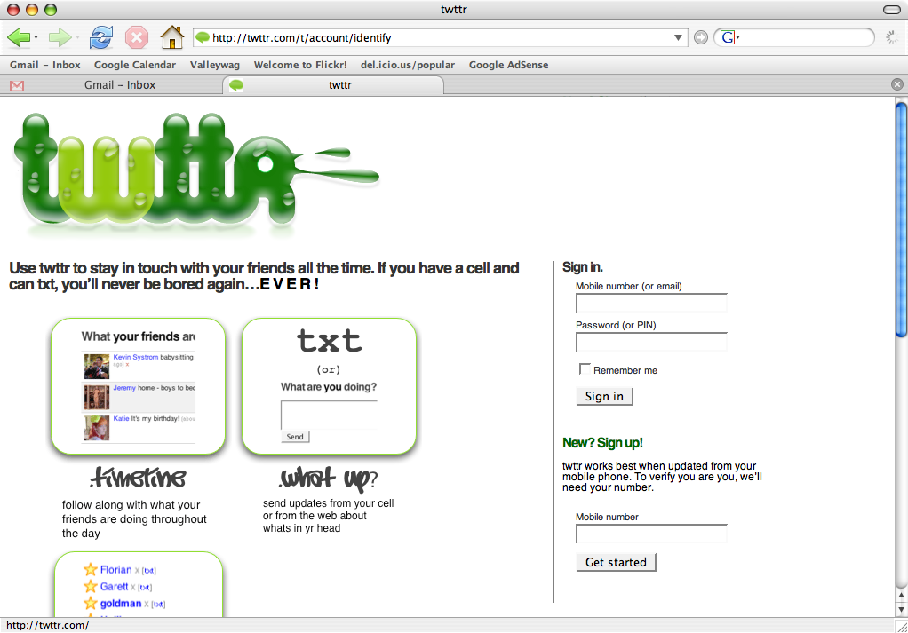

footer: Myles Braithwaite | [myles.coffee](http://myles.coffee/) | [me@myles.coffee](maito:me@myles.coffee)
slidenumbers: true

# [fit] `jrnl`

# [fit] A journal in your command line.

---


My ~programming~ notebooks are filled with random journal entries. It's all the same. I can look back on old ~programming~ notebooks, and know exactly what was going on in my ~professional~ life.

-- Paraphrasing **Sarah Silverman**

^ Keeping a record of what you do is an important thing in your professional life. It helps with documenting what you did in the past for future reference.

^ The only problem with it is...

---


> Dear diary: Today I was pompous and my sister was crazy. Today we were kidnapped by hill folk, never to be seen again. It was the best day ever.

^ Traditional journaling tends to be boring and verbose.

---


^ We tend to write our journal as though it will be read 202 years, 1 month, and 10 days in the future.

---

# Who actually has time to write _paragraphs_ of text?

^ And frankly who has time to write paragraphs worth of meaningless text.

---



^ Microblogging was found in 2006 by Twitter as a way of publishing quick text to the Internet in the most simplest way, text messaging.

---

# Calm down neckbeards

The `finger` protocol's `.project` and `.plan` files predates Twitter.

```bash
$ finger me@myles.coffee
Login: myles                            Name: Myles Braithwaite
Directory: /home/myles                  Shell: /bin/bash
Office Phone +1 (647) 555-1234
On since Wed Mar 10 20:57 (EST) on pts/0 from batgirl.mylesbraithwaite.net
6 seconds idle
No mail.
Project:
Troll the subreddit of /r/conspiracy.
Plan:
World domination.

Office Hours:

Monday       9am  - 11am
Tuesday      11am - 1pm
Wednesday    1pm  - 3pm
Thursday     9am  - 11am
Friday       3pm  - 5pm
```

^ Having only 140 characters allows you to be quick and simple. Of course Twitter doesn't have a good API access anymore and you have to trust them with your important notes. This is where a tool like `jrnl` comes in.

---

```bash
$ jrnl # Will launch in your $EDITOR.

$ jrnl "I am doing a short talk at @GTALUG on jrnl."
[Journal created at /home/myles/BTSync/Journal/journal.txt]
[Entry added to default journal]

$ cat $JOURNAL_FILE
2015-03-10 20:30 I am doing a short talk @GTALUG on jrnl.
```

^ You can create a journal entry really easy from the command line.

^ The entry is saved in a plain text document.

---

```bash
$ jrnl yesterday 1pm: "I started phase three of my @WorldDomination plan."
[Entry added to default journal]

$ cat $JOURNAL_FILE
2015-03-09 13:00 I started phase three of my @WorldDomination plan.

2015-03-10 20:30 I am doing a short talk @GTALUG on jrnl.
```

^ You can create a journal entry dated in the past or future.

---

```bash
$ jrnl yesterday 2pm: "Had some issue with phase three of @WorldDomination.
Apperently the sharkes don't come pre-trained."
[Entry added to default journal]
```

- The `yesterday 2pm` will be interpreted as a time stamp
- The first sentense (everything before `.?!:` marks) will be interpreted as the title.
- The rest will be the body.

---

```bash
$ jrnl < text-document.txt
```

^ You can import a plain text document

---

```bash
$ jrnl *: Phase three of the @WorldDomination plan has successed.
We used dophones instead of sharkes.
[Entry added to default journal]
```

^ You can star an entry

---

```bash
$ jrnl -starred
2015-03-10 14:32 Phase three of the @WorldDomination plan has successed.
| We used dophones instead of sharkes.
```

^ You can view all the starred entries

---

```bash
jrnl -1 --edit
```

^ Edit the last entry in your $EDITOR

---

```bash
$ jrnl -n 3
2015-03-10 14:32 Phase three of the @WorldDomination plan has successed.
| We used dophones instead of sharkes.

2015-03-10 16:00 Had my afternoon expresso @Coffee.

2015-03-10 20:30 I am doing a short talk @GTALUG on jrnl.
```

^ You can view the last x entries

---

```bash
$ jrnl -on 2015-02-25
2015-02-25 09:54 Started working on my @GTALUG presentation on jrnl.
```

^ You can view all the entries from a specific day.

---

```bash
$ jrnl --tags
@coffee              : 4
@worlddomination     : 3
@gtalug              : 2
```

^ List all the tags in your journal.

---

```bash
$ jrnl @gtalug
2015-02-25 09:54 Started working on my @GTALUG presentation on jrnl.

2015-03-10 20:30 I am doing a short talk @GTALUG on jrnl.
```

^ You can get all the entries for a given tag.

---

```bash
$ jrnl @coffee -n 1
2015-03-10 16:00 Had my afternoon expresso @Coffee.
```

^ You can combine mutiple filters together.

---

```json
{
	"journals": {
		"default": "~/BTSync/Journal/journal.txt",
		"work": {
			"journal": "~/BTSync/Journal/work.txt",
			"encrypt": true
		}
	}
}
```

^ jrnl supports mutiple journals so you could spearte your personal, professional, project, etc.

---

```bash
$ jrnl work at 9am: Had a meeting with @Steve
about that electric car project. Managment does
not want to go though with it.
$ jrnl work -n 3
```

^ This helps with organizing your notes across mutiple projects.

---

# [fit] Cross Platform

^ It's written in Python so it pretty much runs where ever Python runs (Linux, FreeBSD, Mac OS X, Windows).

---

# [fit] Sync

^ Because your journal is stored as a plain text file, you can use anything to sync it across your computers. Git, Dropbox, Bittorrent Sync, ownCloud, etc.

---


# [fit] Encryption

^ Encryption is handled though pycrypto which isn't exactly cross platform.

---

```python
import hashlib, Crypto.Cipher

key = hashlib.sha256(my_password).digest()

with open("journal.txt", "r+") as f:
	cipher = f.read()

	crypto = AES.new(key, AES.MODE_CBC, iv=cipher[:16])

	plain = crypto.decrypt(cipher[16:])
	plain = plain.strip(plain[-1])
	plain = plain.decode("utf-8")

	f.write(plain)
	f.truncate()
```

^ Here is an example of how you would decrypt your journal.

^ As you can see your journal is stored in "military-grade" AES encrypt. Of course...

---


# If you're typing the letters A-E-S into your code, you're doing it wrong.

- <http://www.cs.berkeley.edu/~daw/teaching/cs261-f12/misc/if.html>


^ AES might not be the best way to store encrypted data. But if this is an acutal problem for you maybe you should move out into the woods and live off the land.

---

# How to install

```bash
$ [sudo] aptitude install python-pip python-crypto
$ [sudo] pip install jrnl
```

---

# Write your own

```bash
#!/bin/bash
DATE=`date +"%Y-%m-%d %H:%M"`
read
printf "$DATE $REPLY\n\n" >> "journal.txt"
```

^ Because it's just a text file you can easily write your own command line application.

---

* Web: [myles.coffee](http://myles.coffee)
* Email: [me@myles.coffee](mailto:me@myles.coffee)
* Twitter: [@mylesb](https://www.twitter.com/mylesb)

---


To the extent possible under law, [Myles Braithwaite](http://myles.coffee/) has waived all copyright and related or neighboring rights to **jrnl - A journal in your command line**. This work is published from: _Canada_.

---

You can view the source for this presentation at <https://github.com/myles/2015-03-10-jrnl>.

---


